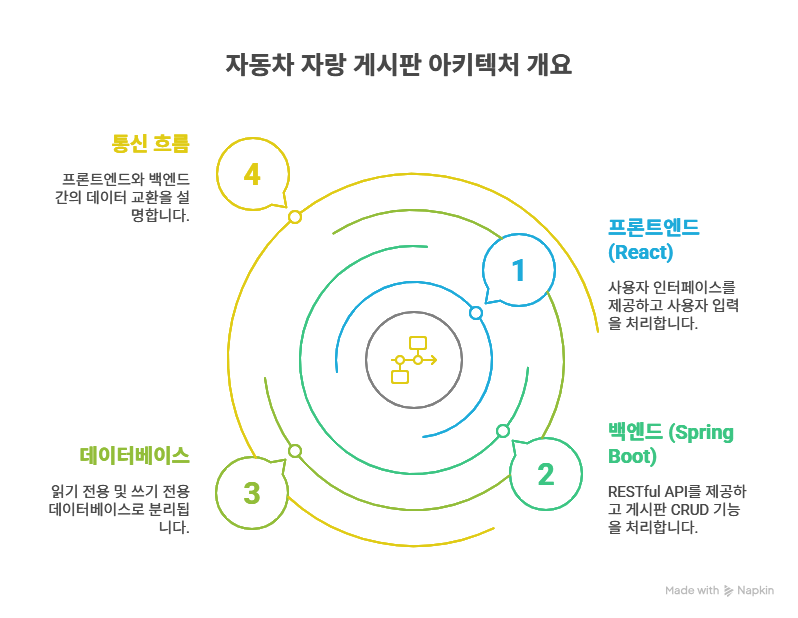

# Today Car - 자동차 자랑 



## 구성
- 프론트엔드: React + TypeScript (Vite)
- 백엔드: Spring Boot (Gradle)
- 데이터베이스: read/write 분리(H2 예시, 운영 시 MySQL 등으로 교체)

## 실행 방법

### 프론트엔드
```bash
npm install
npm run dev
```

### 백엔드
```bash
cd backend
./gradlew bootRun
```

## 주요 기능
- 자동차 자랑 게시글 등록/조회
- 게시글 이미지 URL 등록(추후 파일 업로드로 확장 가능)
- DB read/write 분리 구조 예시 포함
